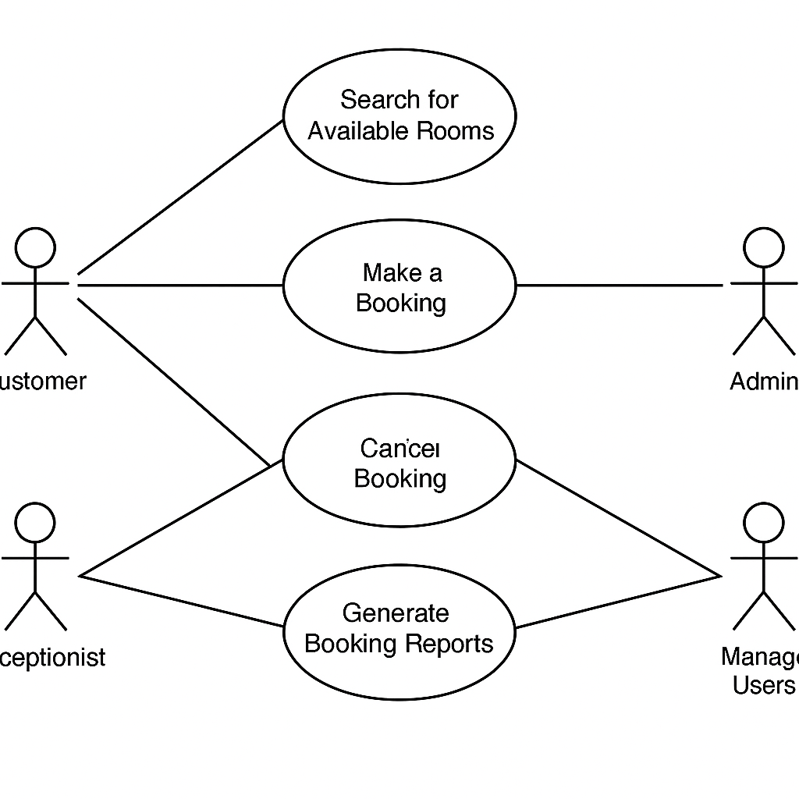

# Requirement Analysis in Software Development
This repository is dedicated to exploring the process of requirement analysis in software development.
It contains documentation, examples, and tools that help identify, gather, and manage software requirements effectively.
The purpose of this repository is to provide resources for students, developers, and project managers to understand and apply best practices in requirement analysis to ensure successful software project outcomes.

## What is Requirement Analysis?

Requirement Analysis is a fundamental phase in the Software Development Life Cycle (SDLC) that involves identifying, gathering, analyzing, and documenting the functional and non-functional requirements of a software system. The goal is to clearly understand what the stakeholders need the software to accomplish and ensure those needs are accurately translated into system specifications.

This phase typically involves various stakeholders, including clients, end-users, project managers, and developers, working collaboratively to define the scope and expectations of the software project. Techniques such as interviews, questionnaires, use case analysis, and modeling tools like UML (Unified Modeling Language) are commonly used during this process.

### Why is Requirement Analysis Important?

Requirement Analysis is critical because:

- **It lays the foundation** for design, development, and testing activities. A clear understanding of requirements ensures that the software system is built correctly and fulfills its intended purpose.
- **It minimizes errors and rework** by identifying potential misunderstandings or incomplete requirements early in the project, saving time and costs.
- **It ensures stakeholder alignment** by involving all parties in defining the system's goals and scope, leading to higher satisfaction with the final product.
- **It improves project planning** by providing accurate estimates for time, resources, and budget based on a solid understanding of what needs to be developed.

Without proper requirement analysis, projects are prone to scope creep, missed deadlines, budget overruns, and software that fails to meet user needs.

## Key Activities in Requirement Analysis

Requirement Analysis involves several critical activities that ensure software requirements are thoroughly understood and correctly implemented. The five key activities are:

- **Requirement Gathering**
  - Involves collecting high-level requirements from stakeholders such as clients, users, and subject matter experts.
  - Focuses on understanding the business goals, user needs, and constraints.
  - Tools used: interviews, surveys, observation, and document analysis.

- **Requirement Elicitation**
  - Refines gathered data by engaging with stakeholders to clarify and elaborate on requirements.
  - Techniques include brainstorming, focus groups, prototyping, and workshops.
  - Helps uncover hidden needs, assumptions, and system expectations.

- **Requirement Documentation**
  - Translates the elicited requirements into formal documentation such as Software Requirement Specification (SRS) documents.
  - Ensures that requirements are written clearly, concisely, and unambiguously for all stakeholders to understand.
  - Documents can include user stories, use cases, and requirement traceability matrices.

- **Requirement Analysis and Modeling**
  - Involves evaluating and organizing requirements to identify conflicts, overlaps, and feasibility.
  - Utilizes modeling tools like data flow diagrams, entity-relationship diagrams, and UML diagrams to visualize and validate system behavior and structure.
  - Helps in transforming raw requirements into structured inputs for design and development.

- **Requirement Validation**
  - Ensures that the documented requirements accurately reflect stakeholder needs and are complete, consistent, and testable.
  - Techniques include reviews, walkthroughs, inspections, and formal validation meetings.
  - Prevents costly changes by catching issues before development begins.

## Types of Requirements

In software development, requirements are generally categorized into two main types: Functional Requirements and Non-functional Requirements. Both are essential for building a reliable and efficient system.

### Functional Requirements

Functional requirements describe what the system should do — the specific behaviors, functions, and processes it must support.

**Definition:**  
These are the features and operations that define how the system will behave in response to certain inputs or in specific situations.

**Examples in a Booking Management Project:**
- Users should be able to create, modify, and cancel bookings.
- The system should allow customers to search for available rooms based on dates and preferences.
- Admin users must be able to generate booking reports.
- The system should send email notifications upon successful booking or cancellation.
- A login system must differentiate between customer, receptionist, and admin roles.

### Non-functional Requirements

Non-functional requirements define the quality attributes, performance, and constraints of the system rather than specific behaviors.

**Definition:**  
These describe how the system performs under certain conditions, including usability, reliability, performance, and security.

**Examples in a Booking Management Project:**
- The system should handle up to 1,000 concurrent users without performance degradation.
- All pages should load within 2 seconds under normal network conditions.
- The application must be accessible on mobile devices and desktop browsers.
- The system must encrypt sensitive user information such as passwords and payment details.
- Availability of the system should be 99.9% uptime annually.

## Use Case Diagrams

Use Case Diagrams are a visual modeling tool used in software engineering to illustrate the interactions between users (actors) and a system to achieve specific goals (use cases). These diagrams help stakeholders quickly understand the system's functionality and the roles different users play.

### Benefits of Use Case Diagrams:
- Provide a high-level overview of system functionality.
- Help in identifying the interactions between users and the system.
- Support requirement analysis and system design phases.
- Serve as communication tools between technical and non-technical stakeholders.

### Use Case Diagram for the Booking Management System

The following diagram illustrates key actors and their interactions with the system:

**Actors:**
- Customer
- Receptionist
- Admin

**Use Cases:**
- Register/Login
- Search for Available Rooms
- Make a Booking
- Cancel Booking
- Modify Booking
- Generate Booking Reports
- Manage Users

## Acceptance Criteria

Acceptance Criteria are a set of predefined conditions that a software product must meet to be accepted by the stakeholders, particularly the client or end user. These criteria define what is considered "done" for a given feature or user story and serve as a basis for validating functionality.

### Importance in Requirement Analysis:
- **Clarity:** Helps in eliminating ambiguity by clearly defining what the system should do from the user’s perspective.
- **Testability:** Provides measurable outcomes that can be used for quality assurance and testing.
- **Alignment:** Ensures that developers, testers, and stakeholders have a shared understanding of the feature’s expectations.
- **Traceability:** Links requirements to their implementation and validation phases in the software development process.

### Example: Acceptance Criteria for the Checkout Feature

**Feature:** Checkout Process in Booking Management System

**Acceptance Criteria:**
- User must be logged in to access the checkout page.
- System should display a summary of the selected room(s), booking dates, and total cost.
- User must be able to select a payment method (e.g., credit card, PayPal).
- System must validate payment details before processing the transaction.
- A booking confirmation should be generated and emailed to the user upon successful payment.
- In case of payment failure, the user should be prompted with an error message and given a chance to retry.

